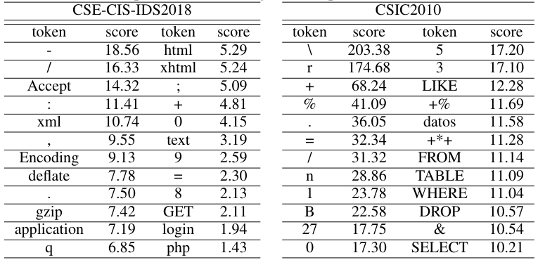

# HTTP2vec: Embedding of HTTP Requests for Detection of Anomalous Traffic

This repository is the official implementation of **HTTP2vec: Embedding of HTTP Requests for Detection of Anomalous Traffic**.

 


## Usage

To setup an environment and install requirements (note: we used python3.9, but the code should work fine with Python>=3.6):

```setup
python3.9 -m venv venv
source venv/bin/activate
pip install -r requirements.txt
```
In order to pull all files from the DVC remote use `dvc pull` command. This will download all datasets and outputs to the `data/` directory (check the next section for more details).

## Training and evaluation


The project use DVC  (Data Version Control) for data versioning. This allows to reproduce all the stages using only a single command and provides a mechanism to remotely store all data inputs and outputs. We defined the following stages (you can also check the exact command related with stage in `dvc.yaml` file). The first stage depends on datasets from `data/datasets`.

| Stage names (CSIC2010) |  Stage names (IDS2018) | Stage names (UMP) | Description |
| ----------------------------|-----------------------|------------------|-------------|
|1-tokenize-byte_bpe-CSIC2010 |1-tokenize-byte_bpe-IDS2018 | 1-tokenize-byte_bpe-UMP | Trains BBPE tokenizer. The results are saved in `/data/tokenizers` directory |
|2-train_model-roberta-byte_bpe-CSIC2010 | 2-train_model-roberta-byte_bpe-IDS2018 | 2-train_model-roberta-byte_bpe-UMP | Train RoBERTa model using tokenizer from previous stage. The model is saved in `/data/models` |
| 3-vectorize-roberta-byte_bpe-CSIC2010| 3-vectorize-roberta-byte_bpe-IDS2018| 3-vectorize-roberta-byte_bpe-UMP | Generates vectors using a model from previous stage. The obtained space is saved in json format in `/data/vectors/`|
| 4-classify-roberta-byte_bpe-CSIC2010 | 4-classify-roberta-byte_bpe-IDS2018 | 4-classify-roberta-byte_bpe-UMP | Trains and tests a classifier (straitified kfold) using vectors from previous stage. The results are saved in `/data/classification`|
| 4-visualize-roberta-byte_bpe-CSIC2010| 4-visualize-roberta-byte_bpe-IDS2018| 4-visualize-roberta-byte_bpe-UMP | Generates 2D plane using the vectors from third stage. The results are saved in `/data/visualization`| 

To reproduce all the pipelines run: `dvc repro`. If you would like to reproduce a single stage use: `dvc repro -f -s <stage name>` (e.g. `dvc repro -f -s  4-visualize-roberta-byte_bpe-CSIC2010`).

### Scripts for token importance

We provide few extra scripts that are not used in the main DVC pipelines:

- http2vec/get_closest.py - finds *n* closest neighbors to a given sample.
  ```
  PYTHONPATH=. python http2vec/get_closest.py \ 
  data/datasets/CSIC2010/0.txt \
  --context data/vectors/roberta-byte_bpe-smart_CSIC2010/result.json 
  -n 100
  ```
- http2vec/classify-with-token-importance.py - using previously saved classifier and a list of requests, it generates a json file with token importance.
  ```
  PYTHONPATH=. python http2vec/classify-with-token-importance.py \
    closest-csic2010.txt \
    importance-csic2010.json \
    --clf data/classification/roberta-byte_bpe-CSIC2010/lr.pickle \
    --tokenizer data/tokenizers/byte_bpe-CSIC2010 \
    --model data/models/roberta-byte_bpe-CSIC2010
  ```
- http2vec/visualize-importance.py - using a json file from previous script, it generates HTML file with color coded importance.
  ```
  PYTHONPATH=. python http2vec/visualize-importance.py \
    importance-csic2010.json \
    output_path \
    --tokenizer data/tokenizers/byte_bpe-CSIC2010
  ```

### Other 
We also provide our attempt of reimplementing Inception-ResNet-v2 based [CAE](https://ieeexplore.ieee.org/stamp/stamp.jsp?tp=&arnumber=8532358) in `cae/` directory.

## Results

The proposed approch achieves the following performance. Please refer to the paper for a discussion:

| Dataset         | Method  |     FPR90     |     FPR99      |        F1       |       MCC       |
| ----------------|---------|---------------|----------------|-----------------|-----------------|
| CSIC2010        |   LR    |  1.7% +- 0.4% |  7.5% +- 0.6%  |  95.1% +- 0.4%  |  91.6% +- 0.6%  |
| CSIC2010        |   SVC   |  0.3% +- 0.1% |  4.2% +- 0.5%  |  96.9% +- 0.2%  |  94.8% +- 0.3%  |
| CSIC2010        |   RF    |  1.0% +- 0.2% |  7.0% +- 0.6%  |  95.9% +- 0.2%  |  93.0% +- 0.4%  |
| UMP             |   LR    | 12.0% +- 0.0% | 15.0% +- 0.0%  |  92.6% +- 0.1%  |  85.0% +- 0.2%  |
| UMP             |   SVC   | 12.0% +- 0.2% | 15.3% +- 0.3%  |  92.6% +- 0.1%  |  85.0% +- 0.2%  |
| UMP             |   RF    | 12.0% +- 0.2% | 15.3% +- 0.3%  |  92.6% +- 0.1%  |  85.0% +- 0.2%  |
| CSE-CIC-IDS2018 |   LR    |  0.0% +- 0.0% |  0.0% +- 0.0%  |  99.9% +- 0.1%  |  99.8% +- 0.1%  |
| CSE-CIC-IDS2018 |   SVC   |  0.0% +- 0.0% |  0.0% +- 0.0%  |  95.9% +- 0.1%  |  99.8% +- 0.1%  |
| CSE-CIC-IDS2018 |   RF    |  0.0% +- 0.0% |  0.0% +- 0.0%  |  95.9% +- 0.1%  |  99.8% +- 0.1%  |

### Datasets

In our experiments, we used the following datasets (note that all of these are possible to download in a form we used them using `dvc pull` command):

 - [CSIC2010](https://www.tic.itefi.csic.es/dataset/)
 - [CSE-CIC-IDS2018 (IDS2018)](https://registry.opendata.aws/cse-cic-ids2018/) - for evaluation purpose, we used extracted HTTP traffic from Friday, 23-02-2018.
 - UMP - custom dataset, prepared by ourselves.

The table below describes a division of the datasets. The "train" part is only used for training RoBERTa model and "inference" is obtaining embeddings and therefore down-stream tasks.

|  |  CSIC2010 | CSE-CIC-IDS2018 | UMP |
|--|-------------|------------------------|---|
| normal traffic (train) | 36000 | 591175 | 150156 |
| normal traffic (inference) | 36000 | 13591 | 35876 | 
| anomaly traffic (inference) | 25065 | 13591 | 35876 |

### t-SNE visualization of generated vector space

We provide a visualization of generated vector space using t-SNE (`visualization` stage in DVC).


| CSIC2010              | UMP              | CSE-CIC-IDS2018 |
| ----------------------|------------------|-----------------|
 |   | 


### Token importance

|  Most important tokens in 50 anomalous samples  | 
|------------|


|  Exemplary anomaly request from CSIC2010 with color coded tokens importance| 
|----------------------------------------------------------------------------|


